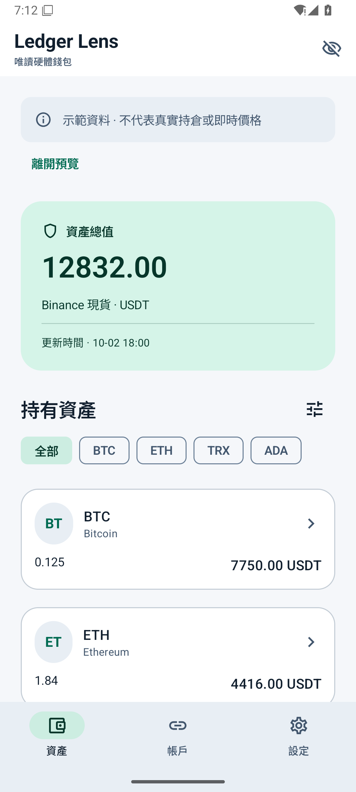
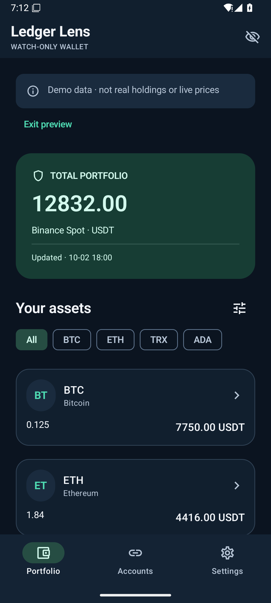

# Ledger Lens

Kotlin / Jetpack Compose Android companion for **Ledger Flex**. Import public keys over USB or Bluetooth, then view Bitcoin, Ethereum, TRON and Cardano mainnet holdings without keeping the device connected. Prices come exclusively from **Binance Spot**, denominated in USDT.

**v0.2.0 adds receiving and Ledger-approved transfers.** Supported sending assets: Native SegWit BTC, ETH, TRX, ADA, Ethereum USDT, TRON USDT and Cardano NIGHT. Private wallet keys and recovery phrases never leave Ledger. Physical Flex signing over USB and BLE still needs device validation; the supplied APK is a debug test build. This independent project is not affiliated with Ledger or Binance.

## Features

- Native BTC, ETH, TRX and ADA; indexed ERC-20, TRC-10, TRC-20 and Cardano native assets.
- Multiple named accounts, with a separate public-key import for each chain/account index.
- Traditional Chinese, Simplified Chinese and English; system, light and dark themes.
- Hide zero quantities, zero values or individual assets; reveal manually hidden assets. Visibility filters never change the total.
- Exact decimal arithmetic; tiny holdings are not hidden by display rounding.
- Explicit balance/price timestamps, incomplete-data notices and retained last-known data on network failures.
- Routine Cardano holdings synchronize at most once per account every 24 hours, including failed attempts. Preparing a transfer and the first successful confirmation refresh the source account separately. A synchronization can require multiple HTTP requests.
- Persistent 24-hour positive/negative Binance market cache; prices use batched requests every 30 seconds while foregrounded, plus manual refresh. Price updates remain independent of balance scans and transaction polling.
- Receive with the imported address, QR, copy/share and optional on-device address verification. Send with paste/QR, exact amounts or maximum, automatic fee reserve, phone review, Ledger approval and local signature verification before automatic broadcast.
- Persisted pending/unknown/confirmed transaction history; network uncertainty never automatically causes another submission. Accounts with unresolved transfers cannot be removed or used to send again.
- Asset rows show their Binance Spot unit price. Unavailable balances/quotes display as unknown rather than zero; partial totals are labelled.
- Android Keystore AES-GCM encryption for public keys, cached holdings and API credentials; app backup disabled.
- Clearly marked, offline demo mode for previewing the interface.

## Coverage and data sources

| Chain | Imported path | Holdings source | Coverage |
|---|---|---|---|
| Bitcoin | `m/84'/0'/account'` | mempool.space, fallback Blockstream Esplora | Confirmed native SegWit receive/change addresses; transaction-history gap scan |
| Ethereum | `m/44'/60'/account'/0/0` | PublicNode + Blockscout | ETH and paginated ERC-20 balances; optional Alchemy token indexer |
| TRON | `m/44'/195'/account'/0/0` | TronGrid | Liquid TRX, TRC-10 and paginated TRC-20 balances |
| Cardano | `m/1852'/1815'/account'` | Blockfrost mainnet with a key, otherwise Koios | Shelley base address UTXO balances and native assets; derived payment-key ownership validation |

Cardano uses your **mainnet Blockfrost project key** when supplied; otherwise it uses public Koios queries. Existing keys continue using Blockfrost. Add a **TronGrid API key** in Settings to avoid strict keyless-query limits; keys or quotas do not guarantee provider availability. Ethereum uses `https://ethereum-rpc.publicnode.com` for balance RPC, and Blockscout for token indexing; an optional Alchemy key uses Alchemy for both. Keys are entered on the phone, encrypted locally and excluded from source control. No Binance key is needed.

The default scan/validation cap is 200 addresses per branch. Bitcoin stops after 20 consecutive unused addresses per branch; these limits can be adjusted in Settings. Cardano uses stake-linked discovery and rejects addresses whose payment key is outside the derived address set. An unregistered stake account falls back to scanning the first gap-sized set of base addresses. Accounts beyond the selected index, nonstandard paths, legacy/Taproot Bitcoin, Cardano enterprise/Byron addresses, staking rewards/frozen TRX, NFT valuation and DeFi positions are outside this release. A capped or failed query is visibly marked; this is not a guarantee of finding every asset on every possible path.

## Prices

Public market endpoints: `https://data-api.binance.vision/api/v3/exchangeInfo?symbol=...&showPermissionSets=false` and `/api/v3/ticker/price?symbols=...`. Only holdings-related, verified Spot pairs against USDT are queried. Both available and missing-market results are encrypted and cached for 24 hours across restarts. Binance `api.binance.com` is a fallback for connectivity/server failures; restrictions and rate limits are respected. A delisted pair can be isolated from a failed batch. USDT itself is the unit of account (1 USDT).

Native coins are mapped by chain identity. Tokens use an explicit contract allowlist in `PriceMapping`, never an untrusted token ticker. The list includes Ethereum USDT/USDC/DAI/WBTC/LINK/MATIC, TRON USDT and Cardano Midnight NIGHT. Cardano NIGHT matches its full policy ID plus asset name (`0691b2fecca1ac4f53cb6dfb00b7013e561d1f34403b957cbb5af1fa4e49474854`) to Binance `NIGHTUSDT` Spot. A missing pair or unknown token identity is valued at **0** and marked as having no price, even if the token's ticker resembles a listed asset. Add reviewed contract mappings to expand coverage. A network error retains cached prices and marks them stale instead of pretending that live prices are zero. No futures, CoinGecko or other price feed is used.

## Run

Requirements: Android Studio, JDK 17, Android SDK 35; phone Android 8.0/API 26 or later, USB host or Bluetooth LE.

1. Open this folder in Android Studio. Let it set the local SDK path, or add `sdk.dir=...` to ignored `local.properties`.
2. Build with `./gradlew testDebugUnitTest lintDebug assembleDebug` (Windows: `gradlew.bat`).
3. Install `app/build/outputs/apk/debug/app-debug.apk` on your phone.
4. Unlock Flex, install/open the selected chain's Ledger app, then choose **Connect Ledger**. Grant Android USB or Bluetooth permission when requested.
5. Choose a chain and account index, import the public key and confirm on the device. Repeat for additional chains/accounts. Cardano app major versions 7 and 8 are supported; unsupported versions fail explicitly.
6. Add provider keys if needed (especially TronGrid), save Settings, then refresh holdings in **Accounts**. **Portfolio** refreshes prices. Disconnecting Ledger does not prevent viewing or public chain queries.
7. Tap an asset for **Receive** or a supported asset for **Send**. Check the full address, amount, fee and total on the phone, then on Ledger. Broadcast acceptance is pending; success requires the first chain confirmation. NIGHT's attached minimum ADA is displayed separately from fees and is received by the recipient.

Account index starts at 0. Ethereum/TRON use the Ledger Live account path above, not every historical derivation convention. The app must never ask for a seed or private key.

## Verification

JVM tests cover public address vectors, USB/BLE framing, capability restrictions/revocation, decimal and QR rules, persisted market/transaction data, batched quotes, TTL and single-attempt submission. The offline engine tests transaction construction, fee reserves, ownership, token change and real cryptographic signature verification through official Ledger SDK adapters, including Cardano v7/v8. Android instrumentation checks the actual WebView engine, native bridge and translated receive/send UI. See [validation notes](docs/VALIDATION.md) and [Flex test checklist](docs/FLEX_TESTING.md).

The app UI/network/persistence/USB/BLE are Kotlin. Official LedgerJS and EMURGO WebAssembly codecs are bundled locally in an isolated WebView with network, file access and navigation disabled. Only build/validate/sign/address-verification operations are exposed. Ethereum USDT display metadata is bundled from Ledger's signed registry; TRON's canonical USDT identity is in the device token table. Transaction helpers run offline; native Kotlin explicitly queries and submits through the chain adapters. To rebuild the engine: Node 22+, `cd signing-engine`, `npm ci --ignore-scripts`, `npm run build`, `npm test`. The checked-in bundle allows ordinary Android builds without Node. See [third-party notices](THIRD_PARTY_NOTICES.md).

Source layout: `ledger/` transports and public-data commands; `crypto/` public address derivation; `data/` chain adapters, prices and encrypted storage; `model/` decimal portfolio model; `ui/` Compose interface and translations.

## Interface preview

Offline **demo data**, not real balances or live market prices:

 

## Protocol and API references

- [Ledger Bitcoin app protocol](https://github.com/LedgerHQ/app-bitcoin-new/blob/develop/doc/bitcoin.md)
- [Ledger Ethereum app](https://github.com/LedgerHQ/app-ethereum), [Ledger TRON app](https://github.com/LedgerHQ/app-tron)
- [Ledger Cardano APDU reference](https://github.com/LedgerHQ/app-cardano/blob/main/doc/apdu_reference.md)
- [Ledger Bluetooth transport](https://github.com/LedgerHQ/ledger-live/tree/develop/libs/ledgerjs/packages/hw-transport-web-ble)
- [BIP84 vectors](https://github.com/bitcoin/bips/blob/master/bip-0084.mediawiki), [Cardano public derivation vectors](https://github.com/input-output-hk/rust-cardano/blob/master/cardano/src/hdwallet.rs)
- [Binance Spot market-data-only endpoints](https://developers.binance.com/docs/binance-spot-api-docs/faqs/market_data_only)
- [Esplora API](https://github.com/Blockstream/esplora/blob/master/API.md), [Blockscout API](https://eth.blockscout.com/api-docs), [Alchemy token balances](https://www.alchemy.com/docs/data/token-api/token-api-endpoints/alchemy-get-token-balances)
- [TronGrid API](https://developers.tron.network/reference), [TronGrid limits](https://developers.tron.network/reference/rate-limits), [Blockfrost API](https://docs.blockfrost.io/), [Koios specifications](https://github.com/cardano-community/koios-artifacts/tree/main/specs)

See [privacy](PRIVACY.md), [security](SECURITY.md) and [UI design](docs/DESIGN.md). Licensed under MIT.
